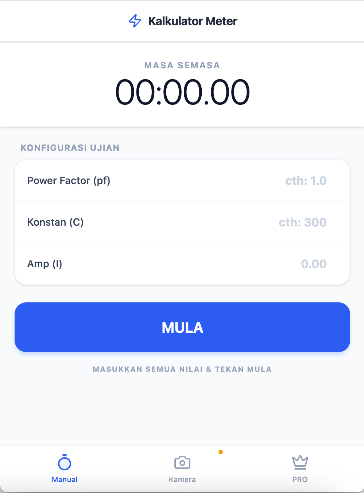
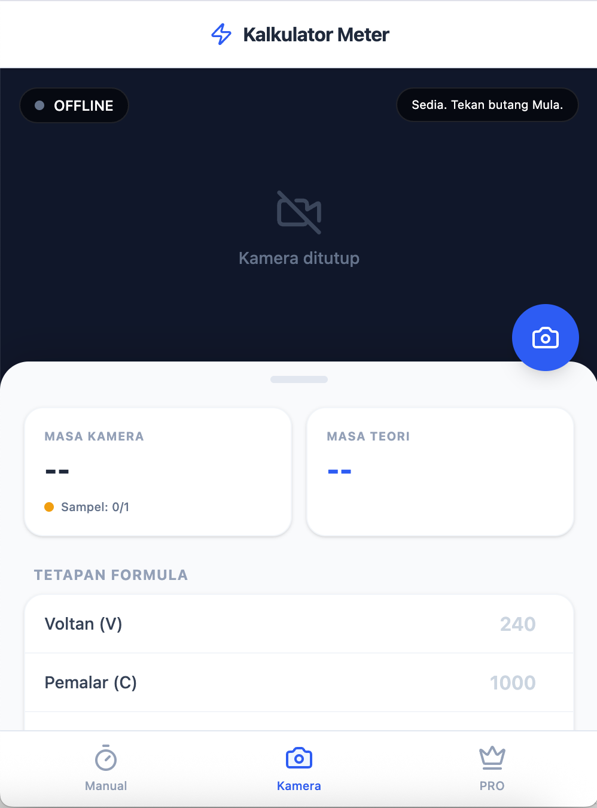

<div align="center">

# ⚡ Camera Error Calculator

**A smart electricity meter accuracy tool — measure errors using blink detection or manual input.**

[](https://react.dev/)
[](https://www.typescriptlang.org/)
[](https://vitejs.dev/)
[](https://tailwindcss.com/)
[](https://capacitorjs.com/)

</div>

## 🌐 Live Demo

**[https://metererror.merakistore.app/](https://metererror.merakistore.app/)**

---

## ✨ About

**Camera Error Calculator** is a PWA and Android app designed for electrical technicians and engineers to accurately measure electricity meter errors.

It uses the standard formula:

```
Error (%) = ((Theoretical Time - Measured Time) / Measured Time) × 100
```

The app offers two measurement modes — a **manual stopwatch** and an **AI-powered camera** that automatically detects the pulse LED blink on the meter.

---

## 📱 Features

| Feature | Free | PRO |
|---------|------|-----|
| Manual blink timing | ✅ | ✅ |
| Multi-sample averaging | ✅ | ✅ |
| Error % calculation | ✅ | ✅ |
| Camera auto-detection | ❌ | ✅ |
| PRO dashboard & history | ❌ | ✅ |

---

## 🖥️ App Screens

<div align="center">

| Manual Mode | Camera Mode |
|:-----------:|:-----------:|
|  |  |
| Enter Power Factor, Meter Constant & Current — then time the LED blinks manually | Point camera at pulse LED — auto-detects blinks with pixel brightness analysis |

</div>

### Manual Mode
Enter voltage, meter constant, and current — then time the LED blinks manually. The app calculates the theoretical time and error percentage instantly.

### Camera Mode *(PRO)*
Point your camera at the meter's pulse LED. The app uses pixel brightness analysis to automatically detect each blink and measure the interval with high precision.

### PRO Dashboard
View measurement history, averages across sessions, and export results.

---

## 🚀 Getting Started

### Prerequisites

- [Node.js](https://nodejs.org/) v18 or higher
- npm

### Installation

```bash
# 1. Clone the repository
git clone https://github.com/amirulasraf89/camera_error_calculator.git
cd camera_error_calculator

# 2. Copy environment file
cp .env.example .env
# Add your GEMINI_API_KEY if using AI features

# 3. Install dependencies
npm install

# 4. Start the development server
npm run dev
```

Open your browser at **http://localhost:3000**

### Build for Production

```bash
npm run build
npm run preview
```

### Android Build (Capacitor)

```bash
npm run build
npx cap sync android
npx cap open android
```

---

## 🗂️ Project Structure

```
camera_error_calculator/
├── src/
│   ├── components/
│   │   ├── CameraView.tsx    # Camera blink detection (PRO)
│   │   ├── ManualView.tsx    # Manual timing mode
│   │   └── ProView.tsx       # PRO dashboard & paywall
│   ├── App.tsx               # Main app shell + bottom nav
│   └── main.tsx              # Entry point
├── android/                  # Capacitor Android project
├── public/                   # Static assets
├── vite.config.ts            # Vite configuration
└── capacitor.config.ts       # Capacitor configuration
```

---

## 🛠️ Tech Stack

| Technology | Purpose |
|------------|---------|
| **React 19** | UI framework |
| **TypeScript** | Static typing |
| **Vite** | Build tool |
| **Tailwind CSS v4** | Styling |
| **Capacitor** | Android wrapper |
| **Google GenAI** | AI integration |
| **Lucide React** | Icons |
| **Motion** | Animations |

---

## ⚙️ How Camera Detection Works

The camera mode captures live video frames via the browser's `getUserMedia` API. Each frame is sampled on a `<canvas>` element to measure the average pixel brightness in the center region. When brightness crosses a configurable threshold (`BLINK_THRESHOLD = 120`), it registers a blink event and records the interval time in milliseconds.

Multiple samples are averaged to reduce human and environmental error.

---

## 📄 License

This project is built for professional and educational use in electrical metering.

---

<div align="center">

Made with ❤️ by **[amirulasraf89](https://github.com/amirulasraf89)**

</div>
